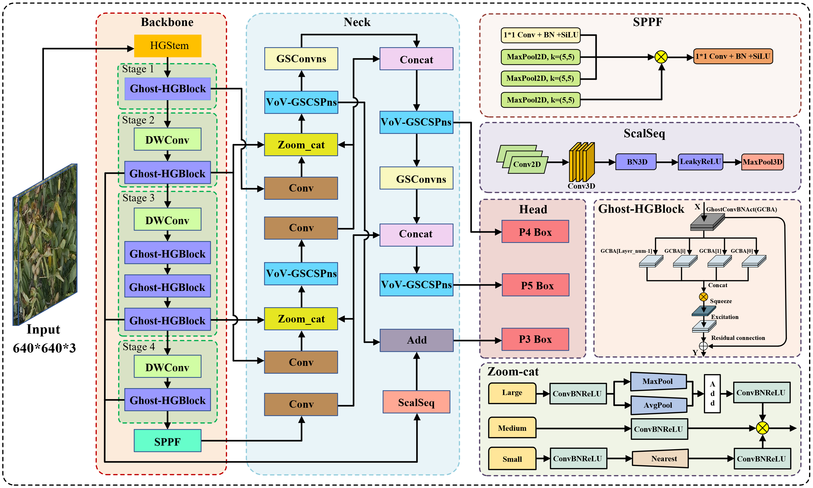
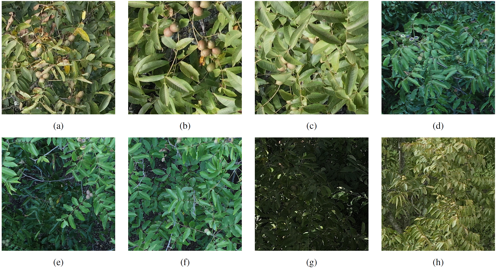
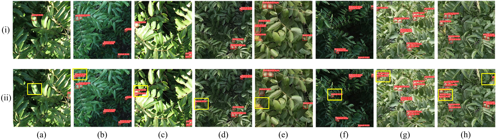
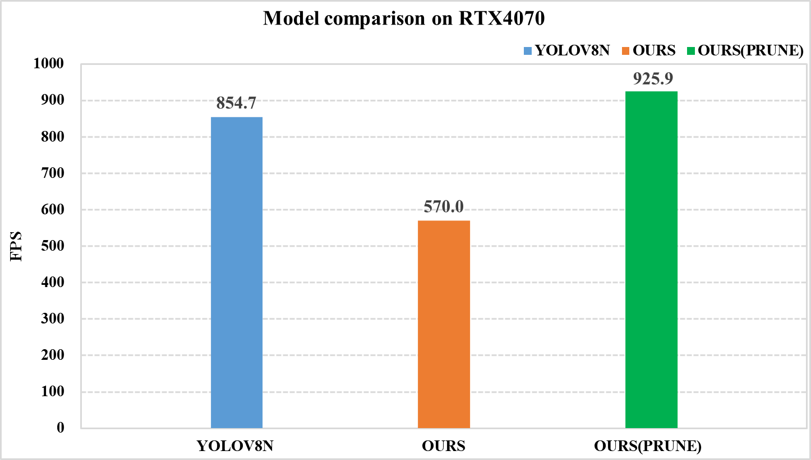
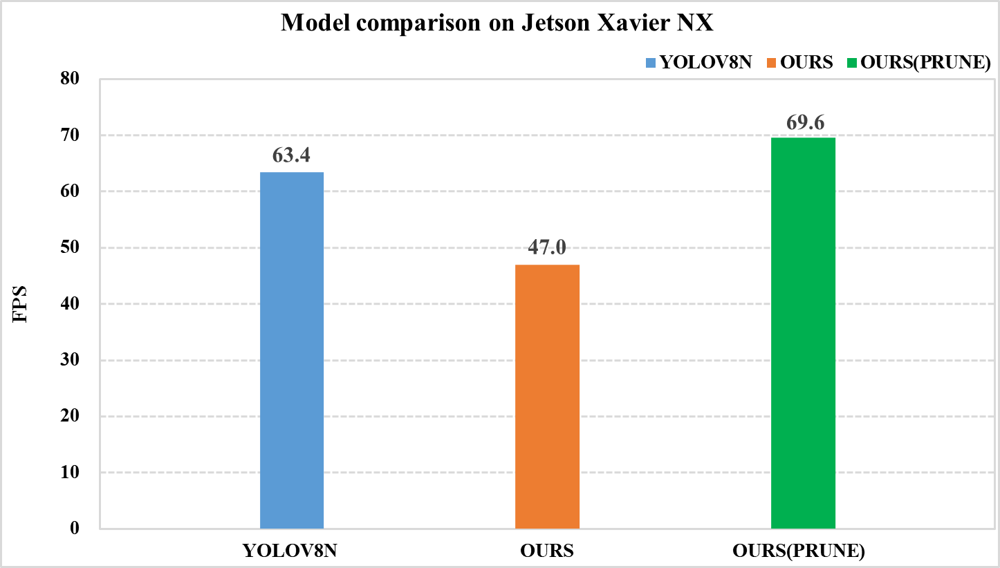
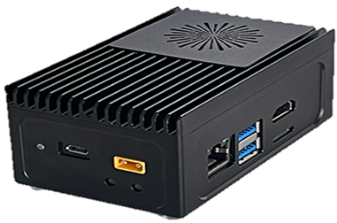
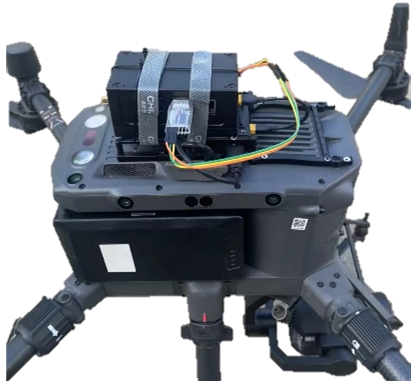

<div align="center">

# WLP-YOLO

**Edge-efficient UAV-based walnut detection for orchard monitoring via lightweight YOLOv8 and structured pruning**

Official implementation for the manuscript:
**"WLP-YOLO: Edge-efficient UAV-based walnut detection for orchard monitoring via lightweight YOLOv8 and structured pruning"**.

[](#citation)
[](#dataset)
[](#deployment)
[](#license)

</div>

---

## Overview

WLP-YOLO, short for **Walnut Lightweight-Pruned YOLO**, is a deployment-oriented one-stage detector for UAV-based on-tree walnut detection in orchard scenes. It is designed for small, dense, and partially occluded walnut targets under complex canopy backgrounds and non-uniform illumination.

The repository contains the code used for:

- UAV walnut detection with a YOLOv8-style detector
- lightweight architecture design with GhostHGNetV2, SlimNeck, and ASF-style scale fusion
- structured channel pruning and post-pruning fine-tuning
- validation, inference, visualization, heatmap generation, and FPS benchmarking
- ONNX/TensorRT-related deployment experiments

This release is prepared for code availability during peer review. Generated files such as model weights, ONNX exports, TensorRT engines, cache folders, and training runs are intentionally excluded from the Git repository.

---

## Highlights

- **Walnut UAV dataset protocol:** 388 cropped images at 640 x 640 with YOLO-format annotations.
- **Lightweight model:** WLP-YOLO improves mAP50 from 0.811 for YOLOv8n to 0.834.
- **Structured pruning:** the pruned model keeps 0.832 mAP50 while reducing the model to 2.7 GFLOPs and 2.4 MB.
- **Edge deployment:** experiments are reported on NVIDIA Jetson Xavier NX with TensorRT/ONNX acceleration.
- **Reproducible code release:** custom Ultralytics modules, model YAML files, pruning scripts, and benchmarking scripts are included.

---

## Framework

<div align="center">
  
</div>

WLP-YOLO follows a design-prune-deploy workflow:

1. Start from a YOLOv8-style one-stage detector.
2. Replace the backbone with GhostHGNetV2 for efficient feature extraction.
3. Use SlimNeck components such as GSConv and VoV-GSCSP to reduce neck complexity.
4. Introduce ASF-style cross-scale fusion modules including Zoom_cat and ScalSeq.
5. Apply structured channel pruning and short post-pruning fine-tuning.
6. Benchmark the pruned model on desktop GPU and Jetson Xavier NX.

The core implementation is in the modified local `ultralytics/` package, especially:

- `ultralytics/nn/backbone/`
- `ultralytics/nn/extra_modules/`
- `ultralytics/nn/tasks.py`
- `ultralytics/models/yolo/detect/compress.py`
- `myyaml/`
- `yolov8-GhostHGNetV2-SlimNeck-ASF.yaml`

---

## Dataset

The experiments use a processed UAV walnut detection dataset collected in Yangbi County, Dali Prefecture, Yunnan Province, China. Images were collected with a DJI Matrice 300 RTK and Zenmuse P1 camera, cropped to 640 x 640, and manually annotated with LabelImg.

| Item | Value |
|------|------:|
| Total images | 388 |
| Image size | 640 x 640 |
| Annotation format | YOLO |
| Classes | 1 (`walnut`) |
| Train / validation split | 270 / 118 |

The dataset includes small targets, dense fruit clusters, leaf and branch occlusion, ripeness variation, low-light scenes, backlighting, and non-uniform canopy illumination.

**Dataset download:** [Google Drive](https://drive.google.com/file/d/1YoDTBLYAqou6YqaENYVpAAkfeRFuDQjs/view?usp=sharing)

Place the dataset as:

```text
data/walnut_388/
  train/
    images/
    labels/
  val/
    images/
    labels/
```

Then check `dataset/walnut.yaml` and `dataset/walnut_new.yaml`.

<div align="center">
  
</div>

---

## Results

### Main Detector Comparison

| Model | P | R | F1 | mAP@0.5 | GFLOPs | FPS | Size (MB) | Params (M) |
|------|------:|------:|------:|------:|------:|------:|------:|------:|
| YOLOv8n | 0.855 | 0.724 | 0.784 | 0.811 | 8.1 | 434 | 6.3 | 3.0 |
| WLP-YOLO | 0.817 | 0.775 | 0.795 | 0.834 | 6.8 | 400 | 4.8 | 2.2 |
| WLP-YOLO (pruned) | 0.813 | 0.772 | 0.791 | 0.832 | 2.7 | 476 | 2.4 | 1.0 |

The unpruned WLP-YOLO improves mAP50 by 2.3 percentage points over YOLOv8n, while the pruned model reduces parameters and computation with only a 0.2 percentage-point mAP50 decrease.

<div align="center">
  
</div>

### Edge Device Throughput

The paper reports separate deployment-oriented benchmarks on RTX 4070 and Jetson Xavier NX.

| Platform | YOLOv8n | WLP-YOLO | WLP-YOLO (pruned) |
|------|------:|------:|------:|
| RTX 4070 | 854.7 FPS | 570.0 FPS | 925.9 FPS |
| Jetson Xavier NX | 63.4 FPS | 47.0 FPS | 69.6 FPS |

TensorRT/ONNX latency experiments on Jetson Xavier NX are also provided:

| Method | Jetson NX latency (ms) | Speedup |
|------|------:|------:|
| PyTorch baseline | 49.4 | 1.00x |
| TensorRT-FP32 | 33.2 | 1.49x |
| TensorRT-FP16 | 29.1 | 1.70x |
| ONNX-GPU | 30.8 | 1.60x |
| ONNX-CPU | 200.1 | 0.25x |

Note: the manuscript also notes that stable ONNX export for all improved WLP-YOLO variants still requires additional engineering because some modules introduce dynamic tensor-shape constraints.

<div align="center">
  <table>
    <tr>
      <td align="center"><br>RTX 4070</td>
      <td align="center"><br>Jetson Xavier NX</td>
    </tr>
  </table>
</div>

---

## Deployment

The edge experiments use a Flame mini box based on NVIDIA Jetson Xavier NX. The deployment environment reported in the manuscript is:

- Python 3.8
- PyTorch 1.12.0
- JetPack 5.1
- CUDA 11.4
- TensorRT acceleration for deployment-oriented latency tests

<div align="center">
  <table>
    <tr>
      <td align="center"><br>Edge-computing box</td>
      <td align="center"><br>UAV-mounted setup</td>
    </tr>
  </table>
</div>

ONNX and TensorRT helper scripts are placed under `ONNX/`. The generated deployment artifacts are excluded from Git and should be rebuilt locally:

- `*.onnx`
- `*.engine`
- OpenVINO export folders
- TensorRT cache/output files

---

## Installation

The main training and evaluation environment in the manuscript:

- Windows 11 Professional
- Intel Core i5-13600K
- 64 GB DDR5 memory
- NVIDIA GeForce RTX 4070, 12 GB VRAM
- Python 3.9
- PyTorch 2.0.1
- CUDA 11.7

Create an environment:

```bash
conda env create -f environment.yml
conda activate wlp-yolo
pip install -e .
```

Or install from `requirements.txt`:

```bash
pip install -r requirements.txt
pip install -e .
```

For Jetson Xavier NX deployment, the manuscript uses Python 3.8, PyTorch 1.12.0, JetPack 5.1, and CUDA 11.4.

---

## Usage

Before running the scripts, download the dataset and update the paths in:

- `dataset/walnut.yaml`
- `dataset/walnut_new.yaml`
- the default paths inside `train.py`, `val.py`, `detect.py`, and `compress.py` if your local folders differ

### Train

```bash
python train.py
```

The default training configuration uses:

- image size: 640
- epochs: 300
- batch size: 8
- optimizer: SGD
- initial learning rate: YOLOv8 default setting
- model configuration: `myyaml/SlimNeck/yolov8-SlimNeck-GhostHGNetV2.yaml`

For the full WLP-YOLO architecture used in the paper, use:

```python
model = YOLO("yolov8-GhostHGNetV2-SlimNeck-ASF.yaml")
```

or another corresponding YAML under `myyaml/`.

### Validate

```bash
python val.py
```

By default, `val.py` loads `best.pt`. Put the trained checkpoint in the repository root or update the weight path.

### Inference

```bash
python detect.py
```

By default, `detect.py` loads `GSA.pt` and writes predictions under `runs/detect/`. Update the `source` and weight path for your own images.

### Structured Pruning and Fine-tuning

```bash
python compress.py
```

The pruning script uses `DetectionCompressor` and `DetectionFinetune` from:

```text
ultralytics/models/yolo/detect/compress.py
```

Important options include:

- `prune_method`: `lamp`, `group_taylor`, `group_norm`, etc.
- `speed_up`: target pruning/compression setting
- `sl_hyp`: sparse-learning hyperparameter YAML
- `epochs`: post-pruning fine-tuning epochs

### FPS Benchmark

```bash
python get_FPS.py --weights weights/wlp_yolo_pruned.pt --batch 16 --imgs 640 640 --device 0
```

Use `--half` for FP16 benchmarking when supported:

```bash
python get_FPS.py --weights weights/wlp_yolo_pruned.pt --batch 16 --imgs 640 640 --device 0 --half
```

### ONNX and TensorRT Experiments

ONNX/TensorRT-related scripts are kept in:

```text
ONNX/
```

Generated `.onnx`, `.engine`, and OpenVINO folders are excluded from this repository. Rebuild them locally when needed.

---

## Repository Structure

```text
WLP-YOLO/
  assets/
  dataset/
    walnut.yaml
    walnut_new.yaml
  data/
    README.md
  docs/
    reproducibility.md
  myyaml/
  ONNX/
  ultralytics/
  weights/
    README.md
  train.py
  val.py
  detect.py
  compress.py
  distill.py
  export.py
  get_FPS.py
  heatmap.py
  plot_result.py
  plot_channel_image.py
  yolov8-GhostHGNetV2-SlimNeck-ASF.yaml
  pyproject.toml
  requirements.txt
  environment.yml
  README.md
  LICENSE
```

Large generated artifacts are not included:

- `*.pt`
- `*.onnx`
- `*.engine`
- `runs/`
- `__pycache__/`
- `.pytest_cache/`
- build and dist folders

---

## Weights

Model weights are not committed to this repository. The trained weights are released through Google Drive:

| Model | File | Description | Download |
|------|------|-------------|----------|
| WLP-YOLO | `wlp_yolo.pt` | Full, unpruned WLP-YOLO model reported in the paper | [Google Drive](https://drive.google.com/file/d/1OBbVycS4jdrDyo5VEel0fU-ODW4s9tnk/view?usp=sharing) |
| WLP-YOLO (pruned) | `wlp_yolo_pruned.pt` | Structured-pruned WLP-YOLO model | [Google Drive](https://drive.google.com/file/d/1eidb0EtrBtzzsaKMmaf-IaNRDwLP3Ppl/view?usp=sharing) |

After downloading, place the weights under:

```text
weights/
  wlp_yolo.pt
  wlp_yolo_pruned.pt
```

or update the weight paths in the scripts.

---

## Citation

If this repository is useful for your research, please cite:

```bibtex
@article{wang2026wlp_yolo,
  title   = {WLP-YOLO: Edge-efficient UAV-based walnut detection for orchard monitoring via lightweight YOLOv8 and structured pruning},
  author  = {Wang, Huihua and Wang, Yibo and Li, Ruoyu and others},
  journal = {Ecological Informatics},
  year    = {2026},
  note    = {Manuscript under review}
}
```

Please update this entry after the paper is accepted and assigned a DOI.

---

## License

This repository contains code derived from Ultralytics YOLO and is released under the **GNU Affero General Public License v3.0 (AGPL-3.0)**. See `LICENSE` for details.
